## 1. A Base do JavaScript: Herança Prototipal vs. Herança Clássica

O JavaScript, em sua essência, é uma linguagem orientada a objetos (OO), mas difere fundamentalmente de linguagens como Java ou C++ por não utilizar um modelo de herança baseado em classes estáticas. Em vez disso, o JavaScript é construído sobre o princípio da **Herança Baseada em Protótipos** (Prototypal Inheritance).

### 1.1. Fundamentos da Orientação a Objetos em JavaScript: Delegação

No modelo prototipal, objetos herdam diretamente de outros objetos, em vez de herdar de classes ou _blueprints_ definidos formalmente. O mecanismo central que governa essa herança é a **Delegação**. Quando uma propriedade, seja um campo de dado ou um método, é solicitada em um objeto, o JavaScript primeiro verifica se essa propriedade existe no próprio objeto (como uma "propriedade própria"). Se a propriedade não for encontrada, a busca é delegada ao objeto ancestral, conhecido como seu protótipo, e esse processo continua recursivamente ao longo da cadeia de protótipos.

Este modelo de delegação oferece uma flexibilidade inerente que não é facilmente replicada em sistemas clássicos. Diferente de linguagens de tipagem estática onde a hierarquia de classes é imutável em tempo de compilação, o JavaScript permite a mutação e até mesmo a troca do protótipo de um objeto em tempo de execução. Essa flexibilidade dinâmica demonstra que o modelo prototipal é, tecnicamente, mais poderoso do que o modelo clássico. Prova disso é que o padrão de herança clássica pode ser trivialmente construído sobre o modelo prototipal, exatamente como o mecanismo de Classes ES6 é implementado, enquanto o inverso seria significativamente mais complexo de alcançar.

### 1.2. A Origem e o Paradoxo da Sintaxe

Historicamente, o JavaScript (originalmente chamado Mocha, depois LiveScript, e finalmente padronizado como ECMAScript) surgiu na década de 90 para lidar com a crescente complexidade e necessidade de dinamismo nas páginas web. No entanto, até a padronização do ECMAScript 2015 (ES6), a linguagem carecia da palavra-chave `class`. Isso forçou os desenvolvedores a imitar padrões de programação orientada a objetos usando funções regulares que agiam como construtores.

Esta imitação levava a um código frequentemente confuso e verboso. Funções construtoras e funções regulares não possuíam distinção sintática clara, e a implementação de herança e encapsulamento exigia manipulação manual complexa dos protótipos. A introdução da sintaxe `class` no ES6 foi uma resposta direta a esse dilema, fornecendo uma maneira limpa e familiar de criar _blueprints_ de objetos e configurar a herança. O principal impacto da sintaxe ES6 foi a unificação e padronização da prática de OO em JavaScript, resolvendo a ambiguidade de padrões que variavam de biblioteca para biblioteca no ambiente ES5.


---


## 2. A Anatomia da Herança Prototipal: O Modelo de Três Pontas (Mecânica ES5)

Para dominar o JavaScript OO antes do ES6, era essencial compreender a interação de três conceitos distintos: `[[Prototype]]`, `.__proto__`, e `.prototype`. A confusão entre eles era a principal fonte de erros no desenvolvimento ES5.

### 2.1. A Tríade Essencial: `[[Prototype]]`, `.__proto__`, e `.prototype`

#### `[[Prototype]]` (O Elo da Cadeia)

O `[[Prototype]]` é uma propriedade interna, oculta e privada que está presente em absolutamente **todos** os objetos JavaScript. Ele funciona como o link fundamental de herança, apontando para o objeto protótipo do qual o objeto atual deve herdar métodos e propriedades. É por meio deste link que o mecanismo de delegação opera. Devido à sua natureza interna, a maneira moderna e recomendada de acessar este link é utilizando o método estático `Object.getPrototypeOf(obj)`.

#### `.prototype` (O Objeto Construtor)

Em contraste, a propriedade `.prototype` não existe em todas as instâncias de objeto; ela é uma propriedade externa presente **apenas** em funções (incluindo funções construtoras e classes). O objeto referenciado por `Função.prototype` é o _blueprint_ que o JavaScript usa para configurar o `[[Prototype]]` de qualquer nova instância criada usando a palavra-chave `new` com essa função. Por padrão, este objeto prototipal contém apenas a propriedade `constructor`, que é uma referência de volta à função original.

#### `.__proto__` (O Acessor Deprecado)

O `.__proto__` (duplo sublinhado) é um acessor (getter/setter) que foi historicamente usado para expor e manipular o link interno `[[Prototype]]` de uma instância de objeto. Embora possa ser encontrado em código legado ou usado para fins de depuração, seu uso é desencorajado e considerado obsoleto. O acesso direto ou a manipulação do `[[Prototype]]` de um objeto em tempo de execução deve ser feito usando `Object.getPrototypeOf()` e `Object.setPrototypeOf()`, respectivamente.

A relação essencial entre esses conceitos é capturada pela equação técnica fundamental que define a herança em tempo de instanciação:

$$\text{(new Foo)}.\text{[[Prototype]]} \equiv \text{(new Foo)}.\text{\_\_proto\_\_} \equiv \text{Foo}.\text{prototype} \quad [10]$$

A tabela a seguir resume as diferenças cruciais entre os três conceitos:

Table 1: Diferenças Conceituais da Tríade Prototipal:

| **Conceito**       | **Definição**                                                   | **Aplica-se a**                        | **Acesso Recomendado**                      |
| ------------------ | --------------------------------------------------------------- | -------------------------------------- | ------------------------------------------- |
| `[[Prototype]]`    | Link interno de delegação/herança (o objeto ancestral).         | Todas as instâncias de objeto.         | `Object.getPrototypeOf(obj)`                |
| `Função.prototype` | Objeto usado para definir o que as futuras instâncias herdarão. | Apenas Funções e Classes Construtoras. | `Função.prototype`                          |
| `objeto.__proto__` | Acessor legado para o `[[Prototype]]`.                          | Instâncias de objeto.                  | Desencorajado (Use `Object.getPrototypeOf`) |

### 2.2. O Processo de Busca (Lookup) na Cadeia de Protótipos

Quando o ambiente JavaScript tenta ler uma propriedade, o processo segue um algoritmo rigoroso conhecido como "Cadeia de Protótipos".

O motor de execução inicia a busca pela propriedade no próprio objeto (as chamadas "propriedades próprias"). Se a propriedade não for encontrada, o motor segue o link interno `[[Prototype]]` para o objeto seguinte na cadeia e repete a busca. Este processo de delegação continua, verificando cada objeto prototipal sucessivamente, até que a propriedade seja encontrada ou até que o final da cadeia seja atingido.

O ponto final e a raiz de quase todas as cadeias de protótipos é o `Object.prototype`. Este é o ancestral máximo que fornece métodos básicos como `toString()`. O protótipo de `Object.prototype` é, por definição, `null`, sinalizando o fim da busca. Se o motor de execução atingir o final da cadeia (`null`) sem encontrar a propriedade, ele retorna `undefined`.

Embora esse mecanismo de busca em múltiplos níveis seja rápido, arquiteturas com cadeias de protótipos excessivamente profundas e complexas podem introduzir um _overhead_ de desempenho, pois cada acesso à propriedade requer uma pesquisa passo a passo. Portanto, o design cuidadoso da estrutura de herança é crucial para garantir a performance e a escalabilidade do sistema.

### 2.3. Diagrama Visual da Cadeia de Protótipos (PlantUML)

A visualização da cadeia de protótipos é fundamental para entender o fluxo de delegação. O diagrama a seguir ilustra uma hierarquia simples de herança entre duas funções construtoras, mostrando como as instâncias se conectam aos seus respectivos protótipos e, finalmente, à raiz `Object.prototype`.

Fragmento do código

```plantuml
@startuml
title Cadeia de Protótipos em JavaScript (ES5/ES6)

object AnimalPrototype
object DogPrototype
object InstanceOfDog

InstanceOfDog.> DogPrototype : [[Prototype]] / __proto__ (Instância herda métodos)
DogPrototype.> AnimalPrototype : [[Prototype]] / __proto__ (Herança entre construtores)
AnimalPrototype.> Object_prototype : [[Prototype]] / __proto__ (Base de todos os objetos)
Object_prototype.> Null : [[Prototype]] (Fim da cadeia)

class DogFunction {
  .prototype --> DogPrototype
}
class AnimalFunction {
  .prototype --> AnimalPrototype
}

note right of DogFunction
  DogFunction.prototype
  é o objeto usado para
  configurar o [[Prototype]]
  de InstanceOfDog
end note

@enduml
```




---


## 3. Implementação Prática: Definição de Métodos e Herança (Padrão ES5)

Antes do ES6, a construção de objetos reutilizáveis e hierarquias de herança seguia um padrão estrito que explorava a distinção entre a função construtora e seu objeto prototipal.

### 3.1. Funções Construtoras e Eficiência de Memória em Sistemas de E-commerce

Em um sistema de e-commerce, a entidade `Produto` é um construtor fundamental. A regra é clara: dados únicos (como `sku`, `preco`) vão na instância, enquanto o comportamento compartilhado (como `calcularImposto`, `formatarPreco`) vai no protótipo para economia de memória.

Se o método `calcularImposto()` fosse definido dentro do construtor, uma cópia completa da função seria criada para _cada um_ dos milhares de itens em estoque, levando a um consumo de RAM proibitivo. Ao definir o método no protótipo, apenas uma única referência é armazenada, acessível por delegação.

```javascript
// Exemplo ES5: Funções Construtoras Profissionais
function Produto(sku, nome, precoBase) {
    // Propriedades de Instância (Dados Únicos)
    this.sku = sku;
    this.nome = nome;
    this.precoBase = precoBase;
}

// Método Compartilhado (Definido no Protótipo)
Produto.prototype.calcularPrecoFinal = function(taxaImposto) {
    // O 'this' aponta para a instância do produto que chamou o método.
    const imposto = this.precoBase * taxaImposto;
    return this.precoBase + imposto;
};

const item1 = new Produto('A123', 'Teclado Mecânico', 150.00);
const item2 = new Produto('B456', 'Mouse Sem Fio', 80.00);

// item1 e item2 compartilham a mesma função calcularPrecoFinal
console.log(item1.calcularPrecoFinal(0.1)); // Saída: 165.00
```

### 3.2. Herança Prototipal em ES5 para Módulos de Logística (`Object.create()`)

O padrão de herança ES5 se torna complexo ao simular hierarquias de classes, como em um sistema de logística onde `EntregaExpressa` herda de `EntregaBase`.

Para que um construtor `EntregaExpressa` herde métodos (como `rastrearStatus()`) de `EntregaBase`, a cadeia de protótipos deve ser manipulada manualmente. O método `Object.create()` é usado para criar um novo objeto de protótipo que aponta para o protótipo pai, garantindo a herança dos métodos compartilhados, como demonstrado abaixo:

1. **Herança do Protótipo (Métodos):** O `[[Prototype]]` de `EntregaExpressa.prototype` é definido para apontar para `EntregaBase.prototype`.
    
    ```javascript
    // 1. Herdar o protótipo pai para acesso aos métodos
    EntregaExpressa.prototype = Object.create(EntregaBase.prototype);
    ```
    
1. **Reatribuição do Construtor:** A correção da referência `constructor` é vital para que `instanceof` e o próprio motor identifiquem corretamente o tipo de objeto. 
    
    ```javascript
    // 2. Corrigir a referência do construtor após sobrescrita
    EntregaExpressa.prototype.constructor = EntregaExpressa;
    ```
    
2. **Chamada do Construtor Pai:** O construtor pai é invocado no contexto (`this`) do filho para inicializar as propriedades base.
    

Este protocolo manual demonstra a verbosidade que a sintaxe `class` ES6 elimina.


---


## 4. O Açúcar Sintático: A Abstração das Classes ES6

A introdução da palavra-chave `class` no ECMAScript 2015 marcou uma mudança paradigmática na forma como o código orientado a objetos é escrito em JavaScript. Contudo, essa mudança é fundamentalmente sintática, e não estrutural.

### 4.1. Classes como Abstração e Padronização

Classes ES6 são uma camada de "açúcar sintático" (_syntactic sugar_) sobre o modelo prototipal existente. Elas fornecem uma sintaxe mais limpa, declarativa e familiar, alcançando o mesmo resultado da manipulação de Funções Construtoras e `.prototype` em ES5.

O motor JavaScript realiza implicitamente a criação da função construtora, a configuração do objeto `.prototype` e a definição de todos os métodos de instância nesse protótipo.

O código abaixo exemplifica a reescrita profissional de um módulo de _backend_ usando a sintaxe `class` (mais limpa) em comparação com o padrão ES5 subjacente:


```javascript
// Exemplo ES6: Módulo de Conexão de Banco de Dados
class DatabaseConnection {
    constructor(dbUrl, timeout) {
        // Propriedades de Instância (Próprias)
        this.dbUrl = dbUrl;
        this.timeout = timeout;
    }
    
    // Método Compartilhado: Definido em DatabaseConnection.prototype
    connect() { 
        console.log(`Conectando a ${this.dbUrl} com timeout de ${this.timeout}ms.`);
        // Lógica de conexão real
    }
    
    // Método Compartilhado: Definido em DatabaseConnection.prototype
    static getPoolSize() {
        return 50; // Retorna um valor padrão do pool de conexões
    }
}
```

A sintaxe `class` comunica claramente a _intenção_ do desenvolvedor, permitindo que os motores de execução modernos apliquem otimizações mais agressivas em comparação com funções genéricas, melhorando a performance e a escalabilidade.

### 4.2. O Mecanismo `extends` e a Dupla Cadeia de Protótipos

O `extends` automatiza a herança, substituindo a complexa configuração manual do ES5.

Quando se define `class Subsystem extends DatabaseConnection`, o JavaScript estabelece dois links prototipais:

1. **Herança da Instância (Métodos):** O `Subsystem.prototype` herda de `DatabaseConnection.prototype`, garantindo que instâncias de `Subsystem` acessem o método `connect()` base.
    
2. **Herança do Construtor (Estática):** A função construtora `Subsystem` herda da função `DatabaseConnection`. Isso é crucial para herdar métodos estáticos, permitindo chamar `Subsystem.getPoolSize()`.


---


## 5. Nuances Técnicas e Decisões de Arquitetura no ES6

### 5.1. Performance e Boas Práticas na Definição de Métodos em Componentes de UI

A decisão de onde colocar um método em uma classe ES6 tem implicações diretas na memória e no contexto de `this`, sendo vital em _frameworks_ de UI onde métodos são frequentemente passados como _callbacks_ (e.g., _event handlers_).

- **Métodos no Protótipo (Eficiente em Memória):** Métodos padrão (`handleClick() {... }`) são definidos no `Class.prototype` e compartilhados por todas as instâncias.21 Esta é a opção mais eficiente em memória. No entanto, se o método for passado como um _event handler_ de um botão, o `this` dentro dele será perdido, exigindo o uso de `this.handleClick.bind(this)` no construtor.

- **Campos de Classe (Seguro para `this`):** Usar _arrow functions_ como campos de classe (`handleClick = () => {... }`) resolve o problema do `this` (fixado lexicalmente à instância), eliminando a necessidade de `bind()` manual.

- **Trade-off:** Essa conveniência sintática sacrifica a eficiência de memória do modelo prototipal, pois uma nova referência de função é criada e duplicada para **cada instância** de componente de UI. Em um sistema com centenas de componentes na tela, isso aumenta o consumo de memória em comparação com os métodos definidos no protótipo.

Table 2: Comparativo Técnico de Definição de Métodos ES6:

| **Método**                       | **Sintaxe**              | **Localização da Função** | **Eficiência de Memória**       | **this Binding (Contexto)**                     |
| -------------------------------- | ------------------------ | ------------------------- | ------------------------------- | ----------------------------------------------- |
| Padrão (Prototype)               | `myMethod() {... }`      | `Class.prototype`         | Alta (Compartilhada)            | Variável (Requer `bind` se usado como callback) |
| Campo de Classe (Arrow Function) | `myField = () => {... }` | Própria Instância         | Baixa (Duplicada por instância) | Fixo (Lexical, sempre aponta para a instância)  |


---


## 6. Casos de Uso Avançados e Aplicações Reais em Sistemas Profissionais

### 6.1. O Padrão de Projeto _Prototype_ (Clonagem de Configurações)

O _Prototype Design Pattern_ é usado para criar novos objetos por clonagem, de forma eficiente, em vez de inicializar novos objetos via construtores.

**Exemplo:** Em um sistema de processamento de dados onde várias tarefas usam configurações base semelhantes, o `Object.create()` é usado para clonar uma configuração mestre:


```javascript
// Configuração Mestra (Protótipo)
const ConfigBase = {
    cacheEnabled: true,
    maxRetries: 3,
    // Método compartilhado
    iniciarProcessamento() { 
        console.log("Iniciando com configurações herdadas..."); 
    }
};

// Nova Configuração (Task-Específica) criada por herança prototipal
// Cria um novo objeto que herda diretamente do ConfigBase
const ConfigTarefaCritica = Object.create(ConfigBase);
// Sobrescreve apenas a propriedade necessária (Shadowing)
ConfigTarefaCritica.maxRetries = 10; 
ConfigTarefaCritica.cacheEnabled = false;

ConfigTarefaCritica.iniciarProcessamento();
// ConfigTarefaCritica só possui duas propriedades próprias, mas herda o método 
// e outras propriedades do ConfigBase, sendo eficiente para clonagem. 
```

A nova instância é leve, pois herda a maioria dos métodos e o estado do protótipo base, sobrescrevendo apenas o necessário, o que é ideal para sistemas que exigem a criação rápida de configurações baseadas em um modelo (como em jogos ou processamento de _pipelines_).

### 6.2. Extensão e Customização em Frameworks (Framework Augmentation)

O acesso direto à propriedade `.prototype` é um mecanismo poderoso usado por _frameworks_ de _frontend_ para injetar funcionalidades globais em tempo de execução.

#### Vue.js (Extensão Global de Serviços)

Em arquiteturas Vue.js mais antigas (Vue 2), a forma padrão de disponibilizar serviços de terceiros (como bibliotecas HTTP ou utilitários de autenticação) para todos os componentes era estender o protótipo da instância global de Vue.

```javascript
// Exemplo de Aumento de Framework: Disponibilizando um serviço HTTP
import axios from 'axios';
// Todos os componentes herdam o método $axios
Vue.prototype.$axios = axios;  
```

Quando qualquer componente era instanciado, ele acessava o serviço `axios` por meio da cadeia de protótipos como `this.$axios`. Este uso demonstra como a maleabilidade do modelo prototipal permite que funcionalidades sejam injetadas em toda a hierarquia de objetos de forma eficiente e global.

#### React.js e `React.Component`

No React, a base de todo _Componente de Classe_ é a classe abstrata `React.Component` . Esta classe é o ancestral que fornece os métodos de ciclo de vida essenciais (`componentDidMount()`, `render()`) que todo componente herda.

Esses métodos são definidos no `React.Component.prototype`. Ao escrever uma classe de componente (e.g., `class MyButton extends React.Component`), o mecanismo `extends` garante que o protótipo do componente filho aponte para o protótipo do `React.Component`, permitindo que o motor de execução encontre e chame métodos como `componentDidMount()` com eficiência de memória. A herança via `extends` é, portanto, a interface moderna para o modelo prototipal que fundamenta o React.


---


## 7. Conclusão: Escolha Informada e o Domínio do JavaScript

A evolução para a sintaxe `class` (ES6) melhorou drasticamente a legibilidade e padronização, tornando-a a escolha padrão para o desenvolvimento moderno. Contudo, o conhecimento aprofundado do modelo prototipal subjacente (ES5) permanece uma habilidade técnica avançada e crucial:

1. **Otimização e Escalabilidade:** A compreensão do modelo prototipal é indispensável para gerenciar a memória em sistemas de alta escala, forçando decisões conscientes sobre a colocação de métodos (no protótipo para eficiência vs. na instância para segurança do `this`).
    
2. **Arquitetura e Extensibilidade:** A capacidade de manipular a cadeia de protótipos é o que permite a implementação de padrões avançados (como o _Prototype Pattern_ de clonagem) e a extensão programática de _frameworks_ consolidados em tempo de execução, oferecendo um controle arquitetural que vai além da sintaxe de classes.
    
3. **Depuração:** O entendimento da dupla cadeia de protótipos e da simulação de `extends` é vital para depurar problemas de herança em cenários de transpilação (ES6 para ES5), onde o comportamento real do código é definido pela lógica prototipal explícita do ES5.
    

O desenvolvedor moderno de JavaScript não apenas usa a sintaxe `class`, mas domina o mecanismo de delegação de protótipos, garantindo que o código seja não apenas elegante, mas também tecnicamente robusto, performático e arquiteturalmente flexível.